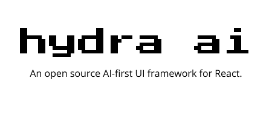

<p align="center">
  
</p>

<p align="center">
  <a href="https://www.npmjs.com/package/hydra-ai"></a>
  <a href="https://github.com/hydra-ai-dev/hydra-ai/blob/main/LICENSE"></a>
  <a href="https://discord.gg/8RMRUPZ9RS"></a>
</p>


# Hydra-AI Template Project

This template project demonstrates how to use the `hydra-ai` npm package in a Next.js application for dynamic component generation using AI.

Get this app running and try adding/changing components to get ideas for how you can use Hydra.

## Table of Contents

- [About this Template](#about-this-template)
- [Getting Started](#getting-started)
  - [Prerequisites](#prerequisites)
  - [Installation](#installation)
  - [Run the App](#run-the-app)
- [Deployment](#deployment)
- [Contributing](#contributing)
- [License](#license)

## About this Template

This template is a React NextJS chat-based social app. You can ask hydra about the other users

The home page is under `/src/app/page.tsx`, and this is where you'll see the `<HydraChat/>` component used.

The instance of HydraClient is created in `/src/hydra-client.ts`, and this is also where components are registered with Hydra. If you want to add your own components for Hydra to control, this is where you'll register them.

## Getting Started

### Prerequisites

Before you begin, ensure you have met the following requirements:

- Node.js (version 14.x or later)
- npm (version 6.x or later) or yarn (version 1.x or later)

### Installation

1. Clone a copy of the repository:

   Get a copy of this repository by clicking the "Use this template" button:

   

   Then, clone your new repo:

   ```bash
   https://github.com/<Your Username>/<Your repo name>.git

   cd your-repo-name
   ```

### Run the App

1. Add OpenAI Key:

   Rename `.env.example` to `.env.local` and add your OpenAI API key.  

   It should look like this:
   ```bash
   OPENAI_API_KEY=<your key>
   ```

2. Install dependencies:

   ```bash
   npm i
   ```

3. Run the app locally:

   ```bash
   npm run dev
   ```

4. Go to http://localhost:3000 to see the running app:


## Deployment

To deploy your app to Vercel, click the button below:

[](https://vercel.com/new/clone?repository-url=https%3A%2F%2Fgithub.com%2Fvercel%2Fnext.js%2Ftree%2Fcanary%2Fexamples%2Fhello-world&env=OPENAI_API_KEY)

Make sure to set up your environment variables, including the `OPENAI_API_KEY`, in your Vercel project settings.

## Contributing

Contributions are welcome! Please feel free to submit a Pull Request.

## License

This project is licensed under the [MIT License](LICENSE).